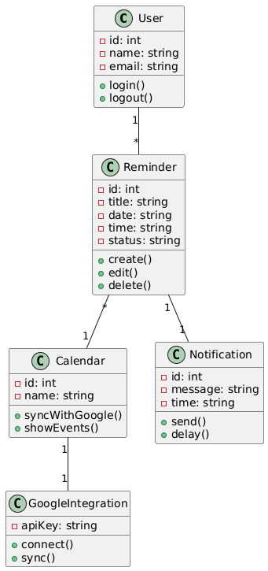
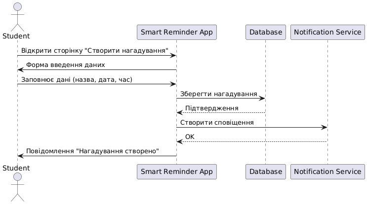
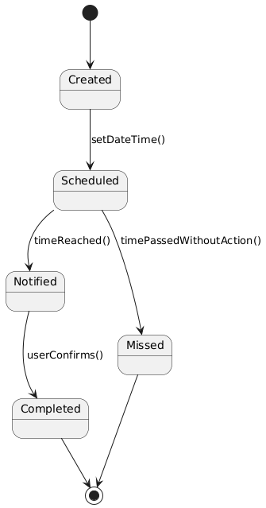

# UML-діаграми проєкту Smart Reminder

## 1. Вступ
Мета: візуалізувати структуру (класи), поведінку (послідовність) і життєвий цикл об’єктів (стани) системи Smart Reminder.

---

## 2. Діаграма класів

> **Пояснення:** показує основні сутності (User, Reminder, Calendar) і зв’язки між ними.

---

## 3. Діаграма послідовностей

> **Use Case:** створення нагадування — як користувач взаємодіє із системою та БД.

---

## 4. Діаграма станів

> **Об’єкт:** Reminder. Від створення → запланованого → повідомлення → завершеного.

---

## 5. Висновки
UML-діаграми допомагають перейти від вимог до структури коду.  
Діаграма класів стане основою для створення таблиць у базі даних.  
Діаграма послідовностей — для опису логіки контролерів у додатку.
